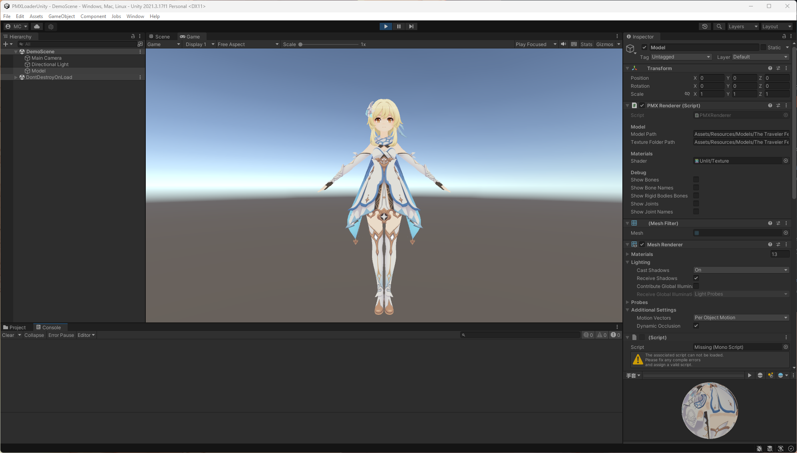

# PMX Loader for Unity

*This is a project for learning more about Unity and MMD (MikuMikuDance) models and animations.*

It is a Unity package for loading MMD models (PMX) and animations (VMD) in Unity.
For now, it only loads the models and textures.

## Features

- [x] Load PMX 2.0 models
- [x] Apply PMX model textures
- [x] Support png, jpg and bmp textures
- [ ] Support tga textures
- [ ] Apply PMX model bones
- [ ] Apply PMX model morphs
- [x] Load VMD animations
- [ ] Transform VMD animations to Unity animations
- [ ] Apply VMD animations to PMX models
- [ ] Use Bullet Physics for physics calculations

## Usage

### Run demo
 - Download the source code
 - Open the project with Unity
 - Open the scene `Assets/Scenes/DemoScene.unity`
 - And play the scene

### Use in your project
The project is not yet available for use for projects.